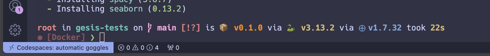

# GESIS Testing

## Setup

1. Sign up for a free Github account
2. Fork the course materials repository
3. Start a new codespace
4. Run `bash setup.sh`
5. Run `source ~/.bashrc`
6. Run `poetry install`

Hang tight, it will take some time to do the installations. When it finishes and you see a line like this:



you're ready to go!

🤘

# Notes

Add poetry to the PATH and install dependencies:

```zsh
export PATH="/root/.local/bin:$PATH" && poetry install
```

Register the Poetry environment as a Jupyter kernel so it appears in the environment selector:

```zsh
export PATH="/root/.local/bin:$PATH" && poetry run python -m ipykernel install --user --name=gesis-tests --display-name="GESIS Tests (Poetry)"
```

Confirm it is available as a kernel: 

```zsh
jupyter kernelspec list
```